[](https://github.com/ilko-os/1c-additional-data-processor-template/releases/latest)
[](https://github.com/ilko-os/1c-additional-data-processor-template/releases)
[](https://github.com/ilko-os/1c-additional-data-processor-template/blob/main/LICENSE)
[](https://openyellow.org/grid?filter=top&repo=1135541688)

# Шаблон дополнительной обработки для конфигураций 1с на основе БСП

## Вступление

Понравилась идея заполнения параметров в консоли запросов в проекте https://github.com/cpr1c/tools_ui_1c.
Применил аналогичный подход к механизму дополнительных отчетов и обработок и разработал данный шаблон.

## Бизнес-потребность

> [!NOTE]  
> Функциональность дополнительных отчетов и обработок используется для оперативной доработки учетной системы без изменения основной конфигурации, что в некоторых случаях упрощает поддержку и последующие обновления.
> Описание доступно в документации по БСП в разделах [Программный интерфейс](https://its.1c.ru/db/bsp321doc#content:984:hdoc) и [Пользовательская документация](https://its.1c.ru/db/bsp321doc#content:3059:hdoc)

При разработке с нуля, а также доработке (адаптации) "своих" и "чужих" дополнительных обработок, возникают задачи по управлению настройками:
- добавление
- редактирование
- просмотр
- доступ к настройкам из программного кода

Каждый разработчик или команда придумывает свои структуры и интерфейсы для этого, что иногда вызывает определенные сложности.

Например, изменилось API и нужно в настройках обработки поменять путь к методу c `/api/v2/supplies` на `/api/v3/supplies`.
Возникают вопросы:
- как и где посмотреть текущий путь?
- как безопасно поменять на новый путь и не повредить (зацепить) другие настройки? 
- как быстро откатить измененные настройки?

Данный шаблон призван:
- стандартизировать хранение настроек
- упростить просмотр, добавление и изменение настроек
- упростить доступ к настройкам при написании программного кода
- упростить отладку


## Ключевые возможности

- Интерфейс для управления настройками команд и обработки в целом. Поддерживает следующие типы:
  - Примитивные: Число, Строка, Дата, Булево
  - Ссылочные
  - Составной тип из ссылочных и примитивных типов
  - Массив из ссылочных и примитивных типов, с перечнем возможных типов
  - Список значений из ссылочных и примитивных типов, с перечнем возможных типов
  - Таблица значений с типизацией колонок
- Упрощение отладки при разработке, внедрении и эксплуатации. Достигается за счет:
  - Единого подхода к хранению и доступу к настройкам
  - Единая точка входа для отладки
- Логирование событий в журнал регистрации

## Внешний вид интерфейса и назначение элементов управления

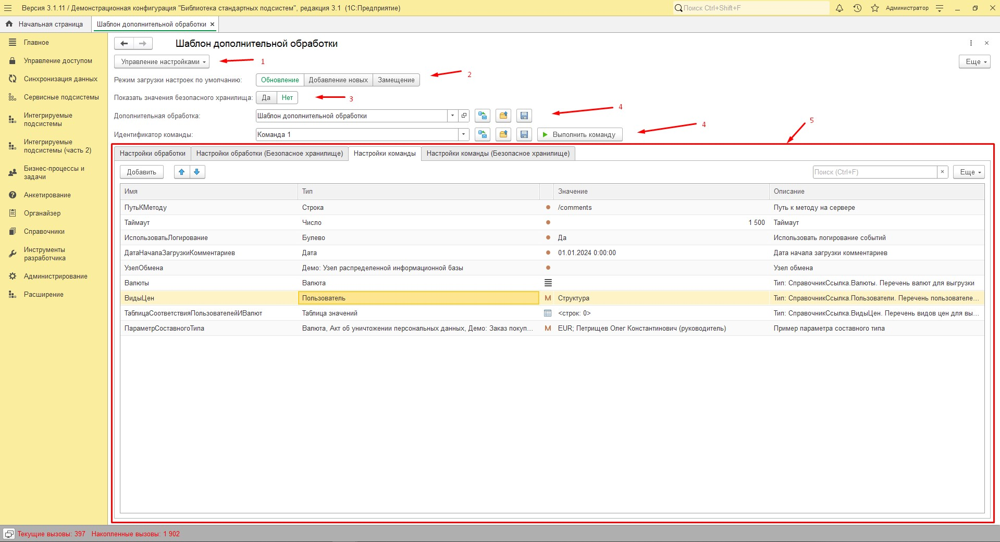

1) `Управление настройками` - содержит команды:
	- `Экспортировать настройки` - экспорт настроек в файл. 
	- `Импортировать настройки` - импорт ранее сохраненных настроек
	- `Очистить настройки` - очищает настройки обработки в информационной базе
2)	`Режим загрузки настроек по умолчанию` - определяет правила загрузки настроек по умолчанию описанных в конфигураторе
	- `Обновление` - если настройка есть в табличной части, то обновляется только поле `Описание`, а поля `Тип` и `Значение` остаются без изменений. Если нет строки с настройкой, то добавляется строка заполняются все поля из настроек, описанных в конфигураторе
	- `Добавление новых` - если настройка есть в табличной части, то строка остается без изменений. Если нет строки с настройкой, то добавляется строка заполняются все поля, описанные в конфигураторе
	- `Замещение` - очистка настроек и последующая загрузка
3) `Показать значения безопасного хранилища` - определяет включен ли `Режим Пароля` для колонок `Значение` на страницах с суффиксом `(Безопасное хранилище)`
	- `Да` - `Режим Пароля` включен
	- `Нет`  - `Режим Пароля` выключен
4) `Дополнительная обработка` 
	- содержит ссылку на сохраненную обработку в информационной базе. При открытии внешней обработки через `Файл -> Открыть...` производится поиск по свойству `Имя` обработки заданному в конфгураторе и реквизиту `ИмяОбъекта` справочника "ДополнительныеОтчетыИОбработки". Если имя обработки изменилось и не совпадает с ранее сохранным в информационной базе, то следует выбрать ссылку явно и выполнить команду `Cохранить настройки обработки`
	- управляет настройками обработки в целом с помощью команд:
		* `Загрузить настройки обработки по умолчанию`
		* `Прочитать настройки обработки`
		* `Сохранить настройки обработки`
		Действие применятся к страницам `Настройки обработки` и `Настройки обработки (Безопасное хранилище)`
5) `Идентификатор команды`
	- позволяет выбрать команду указанную в функция `СведенияОВнешнейОбработке`
	- управляет настройками для выбранной команды с помощью команд:
		* `Загрузить настройки команды по умолчанию`
		* `Прочитать настройки команды`
		* `Сохранить настройки команды`
		Действие применяется к страницам `Настройки команды` и `Настройки команды (Безопасное хранилище)`
		* `Выполнить команду` - запускает выполнение выбранной команды
6) Страницы для 4 групп настроек, см. [подробнее](#работа-с-настройками) 


## Порядок внедрения

### Сохранить актуальный релиз обработки

https://github.com/ilko-os/1c-additional-data-processor-template/releases

### В режиме "1С:Конфигуратор"

1)	Изменить `Имя` и `Синоним` обработки
2)	В процедуре `СведенияОВнешнейОбработке` 
	* изменить значения для `ПараметрыРегистрации.Версия` и `ПараметрыРегистрации.Информация`.Место для изменения отмечено комментариями `// Начало области для модификации {{` и `// }} Окончание области для модификации`
	* добавить (изменить) необходимые команды. Место для изменения отмечено комментариями `// Начало области для модификации {{` и `// }} Окончание области для модификации`    
3)	В процедуре `ВыполнитьКоманду` описать реализацию выполнения команд из предыдущего пункта. Место для изменения отмечено комментариями `// Начало области для модификации {{` и `// }} Окончание области для модификации`
4)	(Необязательный) Добавить необходимы параметры в процедурах:
	- `ЗагрузитьНастройкиОбработкиПоУмолчанию` 
	- `ЗагрузитьНастройкиОбработкиБезопасноеХранилищеПоУмолчанию` 
	- `ЗагрузитьНастройкиКомандыПоУмолчанию`
	- `ЗагрузитьНастройкиКомандыБезопасноеХранилищеПоУмолчанию` 
[см. подробнее](#описание-настроек-в-1сконфигуратор)

### В режиме "1С:Предприятие"

1) Загрузить обработку в справочник `ДополнительныеОтчетыИОбработки`. 
2) Переоткрыть обработку. Реквизит `Дополнительная обработка` заполнится ссылкой на обработку из предыдущего пункта. Сопоставление идет по имени обработки.
3) Заполнить значения настроек для обработки в целом и команд, сохранить настройки. После сохранения нужно Обязательно переоткрыть обработку
4) (Необязательный) Для команд настроить расписание


## Работа с настройками

### Добавление настроек

Настройки делятся на 4 группы:
- `Настройки обработки` - относятся к обработке в целом. Например, `ИмяХоста`, `Порт`, `ЗащищенноеСоединение`  и т.д.  
- `Настройки обработки безопасное хранилище` - "чувствительные" настройки, которые относятся к обработке в целом. Например, `Логин` и `Пароль`, `КлючAPI` и т.д.
- `Настройки команды` - относятся к команде. Например, `ПутьКРесурсу`, `Таймаут`, `РазмерПакета`  и т.д. 
- `Настройки команды безопасное хранилище` - "чувствительные" настройки, которые относятся к команде. Например, `Логин` и `Пароль`, `КлючAPI` и т.д.  

К имени настройки (Колонка `Имя` в табличной части) применяются правила именования ключей структуры (переменных) встроенного языка 1С:Предприятие. 

Поддерживаются 2 подхода добавления настроек:
1) Описание настроек в "1С:Конфигуратор", добавление и задание значение настроек в режиме "1С:Предприятие"
	* Плюсы:
		- Упрощают написание кода с последующим доступам к значениям настроек в режиме "1С:Конфигуратор" за счет предварительного проектирования и прототипирования
	* Минусы
		- Скорость, т.к. требуется писать дополнительный код
3) Добавление настроек и задание их значений в режиме "1С:Предприятие"
	* Плюсы:
		- Простота
		- Скорость
	* Минусы
		- Возможны опечатки в именах настроек, т.к. они независимо добавляются в режиме "1С:Предприятие" и затем используются при написании кода в режиме "1С:Конфигуратор"


#### Описание настроек в "1С:Конфигуратор"

Описание настроек в "1С:Конфигуратор" производится в 4 процедурах модуля объекта обработки:
- `ЗагрузитьНастройкиОбработкиПоУмолчанию`
- `ЗагрузитьНастройкиОбработкиБезопасноеХранилищеПоУмолчанию`
- `ЗагрузитьНастройкиКомандыПоУмолчанию`
- `ЗагрузитьНастройкиКомандыБезопасноеХранилищеПоУмолчанию`

Названия процедур соответствуют одноименным табличным частям (страницам) на форме.
 
В процедуре `ЗагрузитьНастройкиКомандыПоУмолчанию` приведены различные примеры параметров для разных типов, см. спойлер ниже.

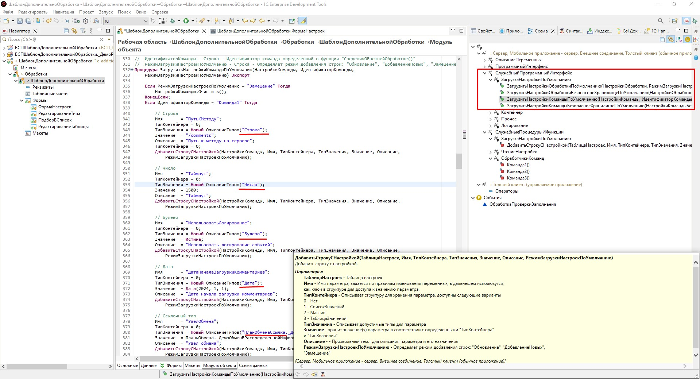


<details>
    <summary>Примеры процедур с различными типами настроек</summary>
	
```bsl
// Загрузить настройки обработки по умолчанию.
// 
// Параметры:
//  НастройкиОбработки - ТаблицаЗначений - соответствует одноименному реквизиту на форме
//  РежимЗагрузкиНастроекПоУмолчанию - Строка - Определяет режим добавления строк: "Обновление", "ДобавлениеНовых", "Замещение"  
Процедура ЗагрузитьНастройкиОбработкиПоУмолчанию(НастройкиОбработки, РежимЗагрузкиНастроекПоУмолчанию) Экспорт

	Если РежимЗагрузкиНастроекПоУмолчанию = "Замещение" Тогда
		НастройкиОбработки.Очистить();
	КонецЕсли;

	Имя       = "Сервер";
	ТипКонтейнера = 0;
	ТипЗначения = Новый ОписаниеТипов("Строка");
	Значение  = "jsonplaceholder.typicode.com";
	Описание  = "Тип: Строка. Путь к серверу. DNS-имя или IP";
	ДобавитьСтрокуСНастройкой(НастройкиОбработки, Имя, ТипКонтейнера, ТипЗначения, Значение, Описание,
		РежимЗагрузкиНастроекПоУмолчанию);
		
	Имя       = "Порт";
	ТипКонтейнера = 0;
	ТипЗначения = Новый ОписаниеТипов("Число");
	Значение  = 443;
	Описание  = "Тип: Число(10, 0). Порт сервера";
	ДобавитьСтрокуСНастройкой(НастройкиОбработки, Имя, ТипКонтейнера, ТипЗначения, Значение, Описание,
		РежимЗагрузкиНастроекПоУмолчанию);
	
	Имя       = "ЗащищенноеСоединение";
	ТипКонтейнера = 0;
	ТипЗначения = Новый ОписаниеТипов("Булево");
	Значение  = Истина;
	Описание  = "Тип: Булево. Использовать защищенное соединение (https)";
	ДобавитьСтрокуСНастройкой(НастройкиОбработки, Имя, ТипКонтейнера, ТипЗначения, Значение, Описание,
		РежимЗагрузкиНастроекПоУмолчанию);

КонецПроцедуры

// Загрузить настройки обработки безопасное хранилище по умолчанию.
// 
// Параметры:
//  НастройкиОбработкиБезопасноеХранилище - ТаблицаЗначений - соответствует одноименному реквзиту на форме
//  РежимЗагрузкиНастроекПоУмолчанию - Строка - Определяет режим добавления строк: "Обновление", "ДобавлениеНовых", "Замещение"
Процедура ЗагрузитьНастройкиОбработкиБезопасноеХранилищеПоУмолчанию(НастройкиОбработкиБезопасноеХранилище,
	РежимЗагрузкиНастроекПоУмолчанию) Экспорт

	Если НастройкиОбработкиБезопасноеХранилище = "Замещение" Тогда
		НастройкиОбработкиБезопасноеХранилище.Очистить();
	КонецЕсли;

	Имя       = "Пользователь";
	ТипКонтейнера = 0;
	ТипЗначения = Новый ОписаниеТипов("Строка");
	Значение  = "";
	Описание  = "Тип: Строка. Пользователь";
	ДобавитьСтрокуСНастройкой(НастройкиОбработкиБезопасноеХранилище, Имя, ТипКонтейнера, ТипЗначения, Значение,
		Описание, РежимЗагрузкиНастроекПоУмолчанию);

	Имя       = "Пароль";
	ТипКонтейнера = 0;
	ТипЗначения = Новый ОписаниеТипов("Строка");
	Значение  = "";
	Описание  = "Тип: Строка. Пароль";
	ДобавитьСтрокуСНастройкой(НастройкиОбработкиБезопасноеХранилище, Имя, ТипКонтейнера, ТипЗначения, Значение,
		Описание, РежимЗагрузкиНастроекПоУмолчанию);
		
		
	// Таблица значений
	Имя       		= "ТаблицаApiKey";
	ТипКонтейнера 	= 3;
	ТипЗначения 	= "Таблица значений";
	Значение  = Новый ТаблицаЗначений;
	Значение.Колонки.Добавить("Аккаунт", Новый ОписаниеТипов("СправочникСсылка._ДемоОрганизации"), "Аккаунт");
	Значение.Колонки.Добавить("ApiKey", Новый ОписаниеТипов("Строка"), "Api Key");
	Значение.Колонки.Добавить("ПсевдонимApiKey", Новый ОписаниеТипов("Строка"), "Псевдоним Api Key");
	Значение.Колонки.Добавить("ДействуетДо", Новый ОписаниеТипов("Дата"), "Действует до");
	Описание  = "Ключи для доступа к API и сроки их действия";
	ДобавитьСтрокуСНастройкой(НастройкиОбработкиБезопасноеХранилище, Имя, ТипКонтейнера, ТипЗначения, Значение,
		Описание, РежимЗагрузкиНастроекПоУмолчанию);

КонецПроцедуры

// Загрузить настройки команды по умолчанию.
// 
// Параметры:
//  НастройкиКоманды  - ТаблицаЗначений - соответствует одноименному реквзиту на форме
//  ИдентификаторКоманды - Строка - Идентификатор команды определенный в функции "СведенияОВнешнейОбработке()"
//  РежимЗагрузкиНастроекПоУмолчанию - Строка - Определяет режим добавления строк: "Обновление", "ДобавлениеНовых", "Замещение" 
Процедура ЗагрузитьНастройкиКомандыПоУмолчанию(НастройкиКоманды, ИдентификаторКоманды,
	РежимЗагрузкиНастроекПоУмолчанию) Экспорт

	Если РежимЗагрузкиНастроекПоУмолчанию = "Замещение" Тогда
		НастройкиКоманды.Очистить();
	КонецЕсли;
	Если ИдентификаторКоманды = "Команда1" Тогда     
		
		// Строка
		Имя       =	"ПутьКМетоду";
		ТипКонтейнера = 0;
		ТипЗначения = Новый ОписаниеТипов("Строка");
		Значение  = "/comments";
		Описание  = "Путь к методу на сервере";
		ТипКонтейнера = 0;
		ДобавитьСтрокуСНастройкой(НастройкиКоманды, Имя, ТипКонтейнера, ТипЗначения, Значение, Описание,
			РежимЗагрузкиНастроекПоУмолчанию);  
		
		// Число
		Имя       =	"Таймаут";
		ТипКонтейнера = 0;
		ТипЗначения = Новый ОписаниеТипов("Число");
		Значение  = 1500;
		Описание  = "Таймаут";
		ДобавитьСтрокуСНастройкой(НастройкиКоманды, Имя, ТипКонтейнера, ТипЗначения, Значение, Описание,
			РежимЗагрузкиНастроекПоУмолчанию); 
		
		// Булево
		Имя       =	"ИспользоватьЛогирование";
		ТипКонтейнера = 0;
		ТипЗначения = Новый ОписаниеТипов("Булево");
		Значение  = Истина;
		Описание  = "Использовать логирование событий";
		ДобавитьСтрокуСНастройкой(НастройкиКоманды, Имя, ТипКонтейнера, ТипЗначения, Значение, Описание,
			РежимЗагрузкиНастроекПоУмолчанию);   
		
		// Дата
		Имя       =	"ДатаНачалаЗагрузкиКомментариев";
		ТипКонтейнера = 0;
		ТипЗначения = Новый ОписаниеТипов("Дата");
		Значение  = Дата(2024, 1, 1);
		Описание  = "Дата начала загрузки комментариев";
		ДобавитьСтрокуСНастройкой(НастройкиКоманды, Имя, ТипКонтейнера, ТипЗначения, Значение, Описание,
			РежимЗагрузкиНастроекПоУмолчанию); 
		
		// Ссылочный тип
		Имя       =	"УзелОбмена";
		ТипКонтейнера = 0;
		ТипЗначения = Новый ОписаниеТипов("ПланОбменаСсылка._ДемоОбменВРаспределеннойИнформационнойБазе");
		Значение  = ПланыОбмена._ДемоОбменВРаспределеннойИнформационнойБазе.ПустаяСсылка();
		Описание  = "Узел обмена";
		ДобавитьСтрокуСНастройкой(НастройкиКоманды, Имя, ТипКонтейнера, ТипЗначения, Значение, Описание,
			РежимЗагрузкиНастроекПоУмолчанию);          
		
		// Список значений из Ссылочных типов
		Имя       =	"Валюты";
		ТипКонтейнера = 1;
		ТипЗначения = Новый ОписаниеТипов("СправочникСсылка.Валюты");
		Значение  = Новый СписокЗначений;
		Описание  = "Тип: СправочникСсылка.Валюты. Перечень валют для выгрузки";
		ДобавитьСтрокуСНастройкой(НастройкиКоманды, Имя, ТипКонтейнера, ТипЗначения, Значение, Описание,
			РежимЗагрузкиНастроекПоУмолчанию);
		
		// Массив из Ссылочных типов
		Имя       =	"ВидыЦен";
		ТипКонтейнера = 2;
		ТипЗначения = Новый ОписаниеТипов("СправочникСсылка.Пользователи");
		Значение  = Контейнер_СохранитьЗначение(Новый Массив);
		Описание  = "Тип: СправочникСсылка.Пользователи. Перечень пользователей для выгрузки";
		ДобавитьСтрокуСНастройкой(НастройкиКоманды, Имя, ТипКонтейнера, ТипЗначения, Значение, Описание,
			РежимЗагрузкиНастроекПоУмолчанию);

		// Таблица значений
		Имя       =	"ТаблицаСоответствияПользователейИВалют";
		ТипКонтейнера = 3;
		ТипЗначения = "Таблица значений";
		Значение  = Новый ТаблицаЗначений;
		Значение.Колонки.Добавить("Пользователи", Новый ОписаниеТипов("СправочникСсылка.Пользователи"), "Пользователи");
		Значение.Колонки.Добавить("Валюты", Новый ОписаниеТипов("СправочникСсылка.Валюты"), "Валюты расчета");
		Значение.Колонки.Добавить("ПорядокСортировки", Новый ОписаниеТипов("Число"), "Порядок сортировки");
		//стр = Значение.Добавить();
		//стр.Склад = Справочники.Склады.ПустаяСсылка();
		//стр.ПорядокСортировки = 1;
		Описание  = "Тип: СправочникСсылка.ВидыЦен. Перечень видов цен для выгрузки";
		ДобавитьСтрокуСНастройкой(НастройкиКоманды, Имя, ТипКонтейнера, ТипЗначения, Значение, Описание,
			РежимЗагрузкиНастроекПоУмолчанию);  
		
		// Составной тип
		// Массив из составных типов
		Имя       =	"ПараметрСоставногоТипа";
		ТипКонтейнера = 2;
		//@skip-check bsl-variable-name-invalid
		КЧ = Новый КвалификаторыЧисла(12, 2);
		//@skip-check bsl-variable-name-invalid
		КС = Новый КвалификаторыСтроки(20);
		МассивТипов = Новый Массив;
		МассивТипов.Добавить(Тип("Строка"));
		МассивТипов.Добавить(Тип("Дата"));
		МассивТипов.Добавить(Тип("СправочникСсылка.Пользователи"));
		МассивТипов.Добавить(Тип("СправочникСсылка.Валюты"));
		МассивТипов.Добавить(Тип("ДокументСсылка.АктОбУничтоженииПерсональныхДанных"));
		ТипЗначения = Новый ОписаниеТипов(МассивТипов, , , КЧ, КС);
		Значение  = Контейнер_СохранитьЗначение(Новый Массив);
		Описание  = "Пример параметра составного типа";
		ДобавитьСтрокуСНастройкой(НастройкиКоманды, Имя, ТипКонтейнера, ТипЗначения, Значение, Описание,
			РежимЗагрузкиНастроекПоУмолчанию);
	ИначеЕсли ИдентификаторКоманды = "Команда2" Тогда

		Имя       =	"ПутьКМетоду";
		ТипКонтейнера = 0;
		ТипЗначения = Новый ОписаниеТипов("Строка");
		Значение  = "/todos";
		Описание  = "Путь к методу на сервере";
		ТипКонтейнера = 0;
		ДобавитьСтрокуСНастройкой(НастройкиКоманды, Имя, ТипКонтейнера, ТипЗначения, Значение, Описание,
			РежимЗагрузкиНастроекПоУмолчанию);

	ИначеЕсли ИдентификаторКоманды = "Команда3" Тогда

		Имя       =	"ПутьКМетоду";
		ТипКонтейнера = 0;
		ТипЗначения = Новый ОписаниеТипов("Строка");
		Значение  = "/posts";
		Описание  = "Путь к методу на сервере";
		ТипКонтейнера = 0;
		ДобавитьСтрокуСНастройкой(НастройкиКоманды, Имя, ТипКонтейнера, ТипЗначения, Значение, Описание,
			РежимЗагрузкиНастроекПоУмолчанию);

	КонецЕсли;
КонецПроцедуры
```

</details>

#### Загрузка настроек и значений по умолчанию в режиме "1С:Предприятие"

Для загрузки настроек служат 2 команды

- `Загрузить настройки обработки по умолчанию`
- `Загрузить настройки команды по умолчанию`

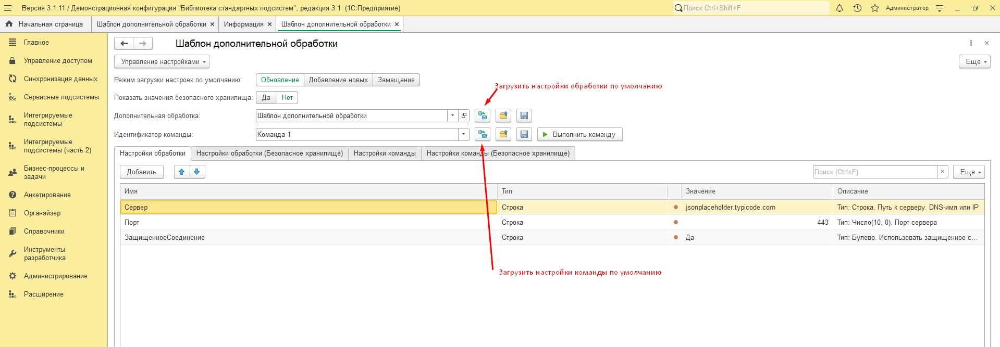

#### Добавление и задание значение настроек в режиме "1С:Предприятие"

Порядок действий:

1) Добавить строку и задать `Имя`, должно соответствовать правилам именования ключей структуры
2) Выбрать `Тип контейнера` и `Тип` для значения
3) Выбрать значение
4) (Необязательный) Написать комментарий 

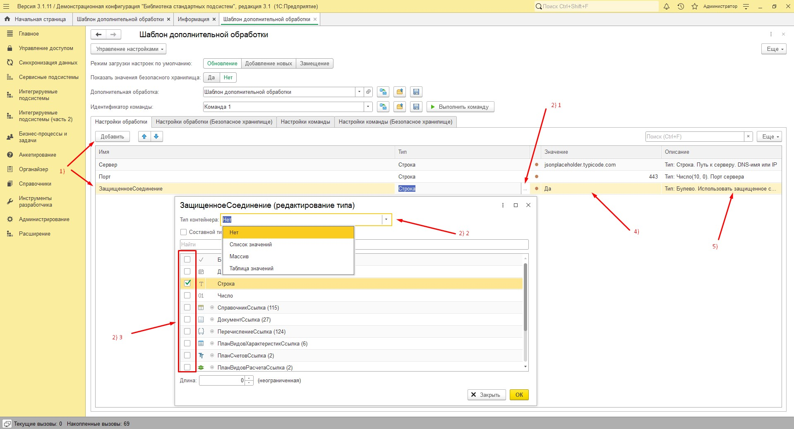

#### Загрузка нескольких значений настроек в режиме "1С:Предприятие" из буфера обмена

Поддерживается загрузка нескольких значений примитивного и ссылочного типа для контейнеров: 
- Список значений
- Массив

Порядок действий изображен на рисунка ниже 

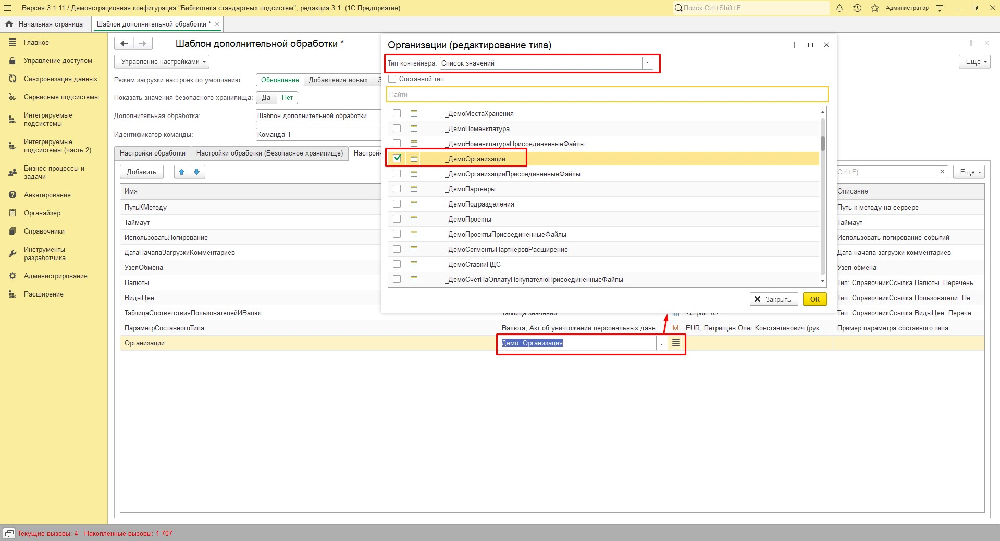
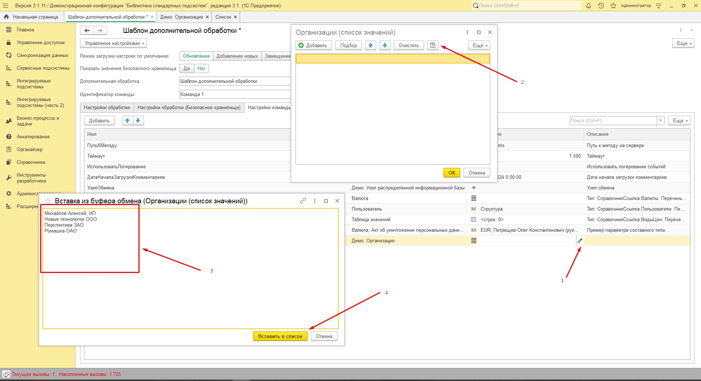
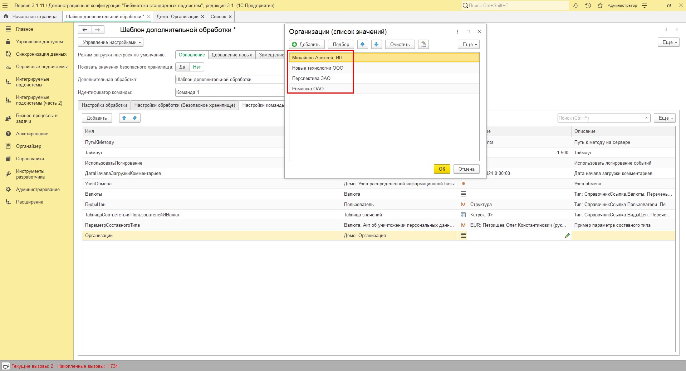


### Экспорт, импорт и очистка настроек

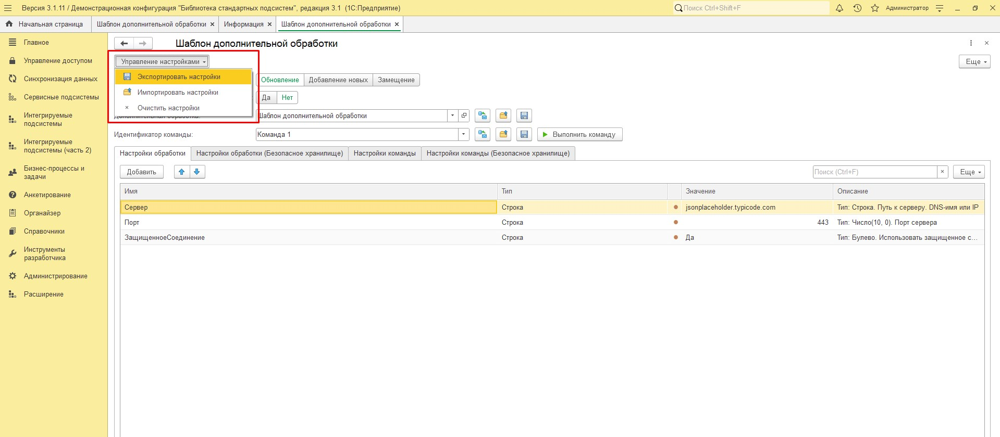

<a id="access-to-settings-in-the-code"></a>
### Доступ к настройкам в коде

<a id="Доступ_к_настройкам_в_коде_1"></a>
1) В модуле объекта обработки доступ к настройкам осуществляется через 4 глобальные переменные:
	- `НастройкиОбработки` 	- Структура - содержит параметры с вкладки "Настройки обработки"
	- `НастройкиОбработкиБезопасноеХранилище` - Структура - содержит параметры с вкладки "Настройки обработки (Безопасное хранилище)"
	- `НастройкиКоманды` - Структура - содержит параметры с вкладки "Настройки команды"
	- `НастройкиКомандыБезопасноеХранилище` - Структура - содержит параметры с вкладки "Настройки команды (Безопасное хранилище)"

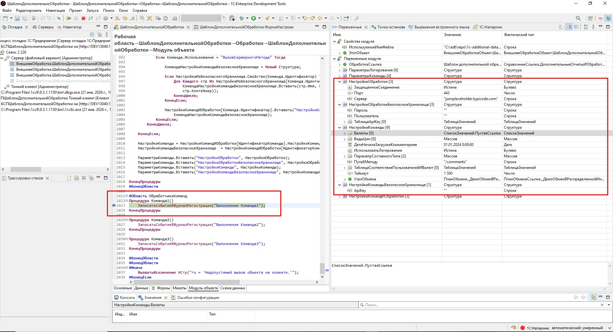

2) Для передачи параметров за пределы обработки, например, вызов процедуры или функции общего модуля служит глобальная переменная `ПараметрыКоманды`. Т.е. это упакованные переменные из [предыдущего пункта](#Доступ_к_настройкам_в_коде_1)
	- `ПараметрыКоманды` - Структура - Содержит параметры сохраненные для обработки в режиме предприятие
		* `ПараметрыКоманды.НастройкиОбработки`
		* `ПараметрыКоманды.НастройкиОбработкиБезопасноеХранилище`
		* `ПараметрыКоманды.НастройкиКоманды`
		* `ПараметрыКоманды.НастройкиКомандыБезопасноеХранилище`

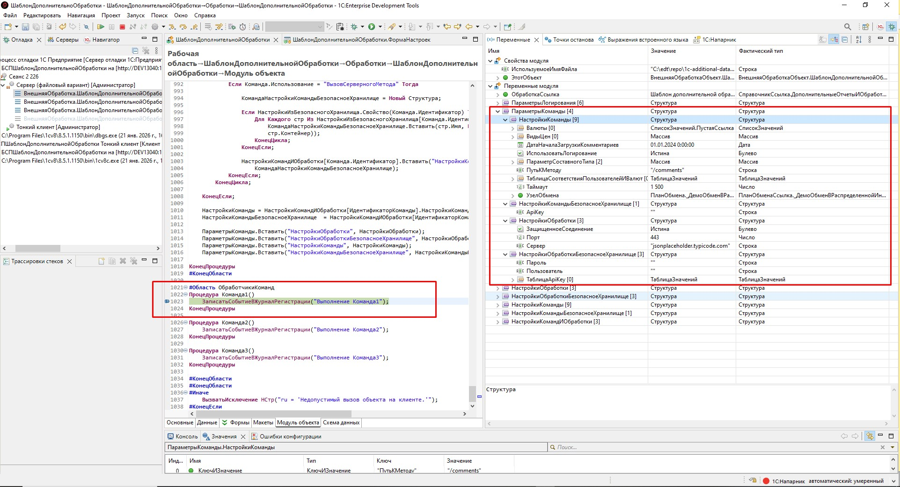

3) Для передачи параметров за пределы обработки и доступа к настройкам других команд служит глобальная переменная `НастройкиКомандИОбработки`

	- `НастройкиКомандИОбработки` - Структура - Содержит параметры сохраненные для обработки в режиме предприятие
		* `НастройкиКомандИОбработки.НастройкиОбработки` - Структура - содержит параметры с вкладки "Настройки обработки"
		* `астройкиКомандИОбработки.НастройкиОбработкиБезопасноеХранилище` - Структура - содержит параметры с вкладки "Настройки обработки (Безопасное хранилище)"
		* `НастройкиКомандИОбработки[ИдентификаторКоманды].НастройкиКоманды` - Структура - содержит параметры с вкладки "Настройки команды" для указанного идентификатора команды
		* `НастройкиКомандИОбработки[ИдентификаторКоманды].НастройкиКомандыБезопасноеХранилище`  - Структура - содержит параметры с вкладки "Настройки команды (Безопасное хранилище)" для указанного идентификатора команды
		
		где `ИдентификаторКоманды` - Строка - возможные значения описаны в функции `СведенияОВнешнейОбработке` в `Команда.Идентификатор`

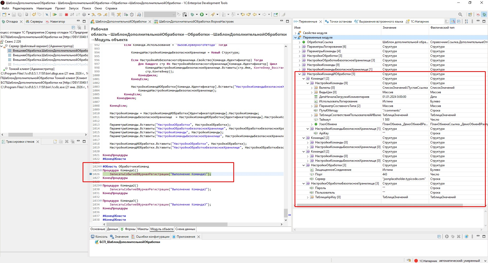

## Приемы отладки

1) Выполнить внедрение
2) Заполнить и сохранить настройки
3) Открыть в режиме 1С:Конфигуратор файл обработки через `Файл -> Открыть...` и поставить точку останова. Как правило, это процедура `ВыполнитьКоманду` и строка `Если ИдентификаторКоманды = "Команда1" Тогда ...`
4) Открыть обработку в режиме 1С:Предприятие через `Файл -> Открыть...`
5) Выбрать команду и нажать `Выполнить`

> [!WARNING]  
> После сохранения настроек в режиме 1С:Предприятие нужно переоткрыть обработку через `Файл -> Открыть...`

> [!IMPORTANT]
> Открывать нужно один и тот же файл обработки в режимах 1С:Конфигуратор 1С:Предприятие. 

Выполняется обработка и ее отладка из файла на диске, а настройки используются из элемента справочника `Дополнительные отчеты и обработки` информационной базы, выбранной в реквизите `Дополнительная обработка`.   

## Порядок обновления на новый релиз обработки

### Рекомендации по разработке

При разработке рекомендуется придерживаться простых правил:
- Изменения вносить только в модуль объекта обработки
	* в функцию `СведенияОВнешнейОбработке` в участок обрамленный `// Начало области для модификации {{` и `// }} Окончание области для модификации`
	* в процедуру `ВыполнитьКоманду` 
	* в область `ЗагрузкаНастройкиПоУмолчанию`
	* в область `ОбработчикиКоманд`

### Порядок обновления

1. Скачать новый релиз шаблона обработки
2. Открыть в конфигураторе 2 обработки
	* новый релиз шаблона обработки
	* обработку на основе шаблона
3. Скопировать из обработки на основе шаблона в обработку нового релиза шаблона:
	* `Имя` обработки
	* `Синоним` обработки
	* в функции `СведенияОВнешнейОбработке` код обрамленный комментариями `// Начало области для модификации {{` и `// }} Окончание области для модификации`
	* в процедуре `ВыполнитьКоманду` код обрамленный комментариями `// Начало области для модификации {{` и `// }} Окончание области для модификации`
	* область `ЗагрузкаНастройкиПоУмолчанию`
	* область `ОбработчикиКоманд`
	* другие измененные участки кода, если были отклонения от рекомендаций
4. Сохранить новый релиз шаблона обработки под новым именем	

	
